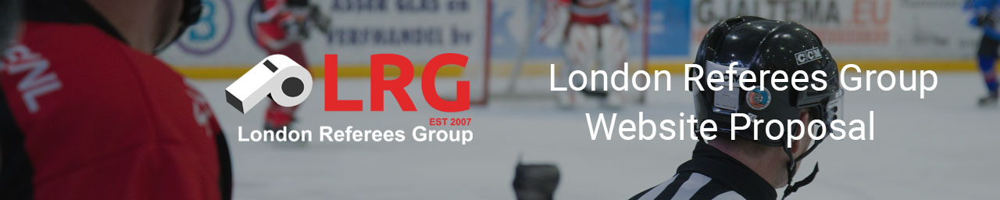

# London Referees Group - Website Proposal

Website propsal for London Referees Group 2021

[Project Roadmap](https://docs.google.com/spreadsheets/d/19bKQ6ZGz-U2W1dZaxSjjux5ulQb5qU52lu3gvD4q2ho/edit#gid=0 "Google Docs")

[All Design and Marketing Assets](https://drive.google.com/drive/folders/1gw6eCUfxoAOKKIl8Q_l1GFYxzW5q2zKr?usp=sharing "Google drive")

## Our Team:

Shannon Lounges - Project Manager

Jagdeep Singh - Graphic Designer

Chieh Yang - Video/3D/Motion Designer

Zen Carriere - Back End Development

Jonathan Miller - Front End Development

## Objective:

Revamp of London Referees Group in London Ontario.

[London Referees Group](https://londonrefereesgroup.com/ "London Referees Group")

## Resources:

[Sass: Syntactically Awesome Style Sheets](https://sass-lang.com/ "Sass Lang")

[CSS Tricks Flexbox Guide](https://css-tricks.com/snippets/css/a-guide-to-flexbox/ "CSS Tricks")

[Pexels Stock Photos](https://www.pexels.com/ "Pexels")

[Pixabay Stock Photos](https://pixabay.com/ "Pixabay")

## Languages/Libraries Used:

HTML5

CSS

SASS

JavaScript

MySQL

PHP

Vue.js

Node.js

## Installation:

No particular installation required. Download repo and open in a code editor. Content will require a live server to view properly, and has Node.js dependencies.

## MIT License:

MIT License

Copyright (c) [2021] [Shannon Lounges, Jagdeep Singh, Chieh Yang, Zen Carriere, Jonathan Miller]

Permission is hereby granted, free of charge, to any person obtaining a copy
of this software and associated documentation files (the "Software"), to deal
in the Software without restriction, including without limitation the rights
to use, copy, modify, merge, publish, distribute, sublicense, and/or sell
copies of the Software, and to permit persons to whom the Software is
furnished to do so, subject to the following conditions:

The above copyright notice and this permission notice shall be included in all
copies or substantial portions of the Software.

THE SOFTWARE IS PROVIDED "AS IS", WITHOUT WARRANTY OF ANY KIND, EXPRESS OR
IMPLIED, INCLUDING BUT NOT LIMITED TO THE WARRANTIES OF MERCHANTABILITY,
FITNESS FOR A PARTICULAR PURPOSE AND NONINFRINGEMENT. IN NO EVENT SHALL THE
AUTHORS OR COPYRIGHT HOLDERS BE LIABLE FOR ANY CLAIM, DAMAGES OR OTHER
LIABILITY, WHETHER IN AN ACTION OF CONTRACT, TORT OR OTHERWISE, ARISING FROM,
OUT OF OR IN CONNECTION WITH THE SOFTWARE OR THE USE OR OTHER DEALINGS IN THE
SOFTWARE.
